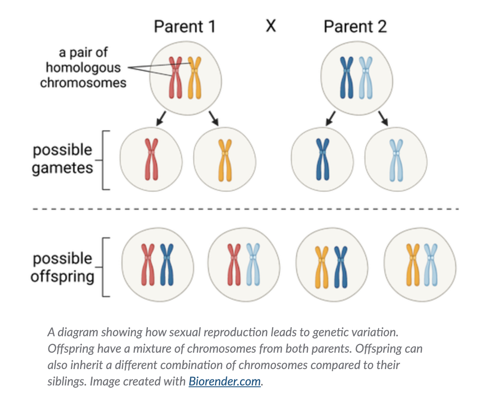

# [Middle school biology](https://www.khanacademy.org/science/ms-biology)

## Unit: Cells and organisms

What are common organelles between plant and animal cells? (cell membrane, mitochondria, nucleus, cytoplasm)

In a plant cell, what is responsible for converting sunlight into sugar? (chloroplasts)

What are the 5 levels of hierarchy in the human body? (cells, tissues, organs, organ systems, body)

Which level is the brain? (nerve system)

In what structure are the genes located within a cell? (nucleus)

## Unit: Organism growth and reproduction

What is the process of making new organisms? (reproduction)

What type of reproduction exhibits genetic variation between siblings? (sexual)

Name an animal that uses asexual reproduction. (starfish)

What is reproductive success? (Related to the number of offspring it has during its life.)

What's are 2 strategies that plants use to increase reproductive success?  (using animals for pollination, seed dispersal)

What are 2 main factors that determine the growth of an organism? (genetic and environmental)

What make up the hereditary material inside an organism’s cells.  (Genes)

An organism’s ---- is all the things the organism is exposed to as it lives and grows. (environment)

## Unit: Matter and energy in organisms

What molecule is responsible for a plant's green color? (chlorophyll)

What inputs are required for photosynthesis? (water, CO2, sunlight)

What are the outputs of photosynthesis? (O2 and sugars)

Food is made up of what 3 general classes of molecules? (Fats, protein, sugars)

What are the common elements that comprise organic molecules?  (Hydrogen, carbon, oxygen, nitrogen)

Molecules in food are used for what 2 main functions? (Building new structures, fuel/chemical energy)

What process allows organisms to get energy from food? (cellular respiration)

What are the inputs to cellular respiration? (glucose/sugar and oxygen)

What are the outputs? (CO2, water and **energy**)

Where in the cell does respiration occur? (cytosol and mitochondria)

## Unit: Interactions in ecosystems
What is the name for all of the living species that live in an area? (community)

What is the name for all living and non-living organisms in an area? (ecosystem)

What is the name for the members of a specific species in an area?  (population)

What do organisms need in order to survive and thrive within an ecosystem? (resources)

Examples of resources are: (food, shelter, oxygen, space)

A ---- resource is one that is not available in endless supply. (limited)

What's the name for interactions when organisms compete for the same set of resources. (Competitive)

---- interactions happen when one organism hunts and eats another organism.  (Predatory)

What's the name for interactions where two organisms of different species benefit from interacting with each other. (Mutualistic)

## Unit: Matter and energy in ecosystems
The vast majority of energy in an ecosystem comes from ----? (the sun).

In a food web diagram, ---- have only arrows going away from them (producers).

In a food web diagram, ---- have only arrows going toward them (decomposers).

In a food web diagram, ---- have  arrows going both away from and toward them (consumers)

Energy that enters an ecosystem eventually leaves as ---- (heat)

What are organisms that make their own food inside their cells? (producers)

What are organisms that eat other organisms? (consumers)

What are organisms that consume dead plant and animal matter? (decomposers)

An organism that only eats producers is called a ---- (primary consumer).

---- is the variety of species in an ecosystem. (Biodiversity)

---- ecosystem services are the resources that people extract from ecosystems. These include foods and drinking water. (Provisioning)

---- ecosystem services are all the processes that keep ecosystems healthy. These include fungi decomposing waste and tree roots preventing erosion. (Regulating)

---- ecosystem services are the foundational processes that underlie all life on Earth. These include photosynthesis and the water cycle. (Supporting)

---- ecosystem services are the ways that ecosystems benefit people’s lives and traditions. For example, many people have a religious or cultural connection to an ecosystem. Ecosystems also provide inspiration, fun, and a sense of well-being. (Cultural)

## Unit: Inheritance and variation
What is an observable characteristic of an organism? (trait)

Traits are passed from parent to offspring through what? (genes)

Genes are part of cell structures called ----  (chromosomes)

Each chromosome consists of 1 long molecule of ----. (DNA)

What does DNA stand for?

How many chromosomes are in a human? (46, or 23 pairs of "homologous" chromosomes)

What are homologous chromosomes? (2 chromosomes with the same size and have the same genes in the same locations)

What is a different version of a gene called? (allele)

What is an image of an organism's genes, arranged into homologous pairs? (karyotype)

### Genes, proteins, and traits

DNA molecules are made up of smaller parts called ---- (nucleotides)

Using the cooking analogy:
- chromosomes --> cookbooks
- genes --> recipes
- nucleotides --> ingredients
- proteins --> meal

How many types of nucleotides are there? (4)

Name the 4 nucleotides
- A adenine
- C cytosine
- T thymine
- G guanine

What is the name of molecules that carry out many different functions in cells, such as providing structure helping carry out chemical reactions? (protein)

Proteins are made up of smaller parts called ----. (amino acids)

The order of nucleotides in a gene determines the order of ---- in the resulting protein. (amino acids)

### Mutations
A ---- is any change to the nucleotide sequence of a DNA molecule. (mutation)

Are all mutations bad? (No, they can be harmful, beneficial, or neutral)

### Inheritance and variation
Humans have two sets of chromosomes in each cell, making humans ---- organisms. (diploid)

Diploid organisms produce either egg or sperm cells, which are known as ----. (gametes)

---- is the fusion of gametes from two parents. (Fertilization). Fertilization leads to new, diploid offspring.

When a parent forms a gamete, only one chromosome from each homologous pair is included at random. So, an offspring might inherit a different combination of chromosomes (and alleles) compared to its siblings.

### Genetics vocabulary and Punnett squares

An organism's observable traits are affected by its ---- (genes)

An organism's combination of genes is called its ---- (genotype)

A ---- genotype has two of the same alleles. (homozygous)
A ---- genotype has two different alleles. (heterozygous)

A ---- is an observable version of a trait. (phenotype)

